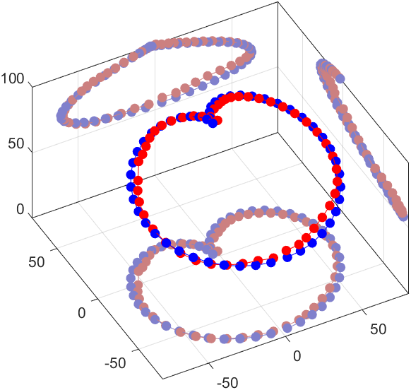
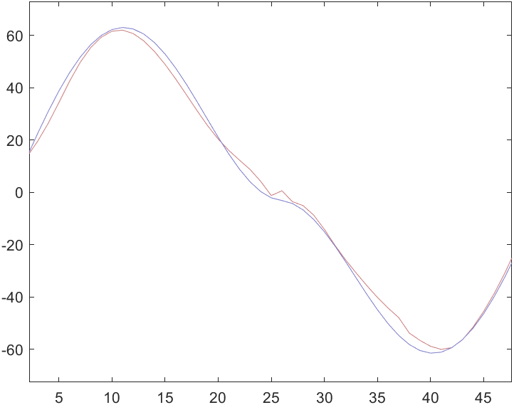
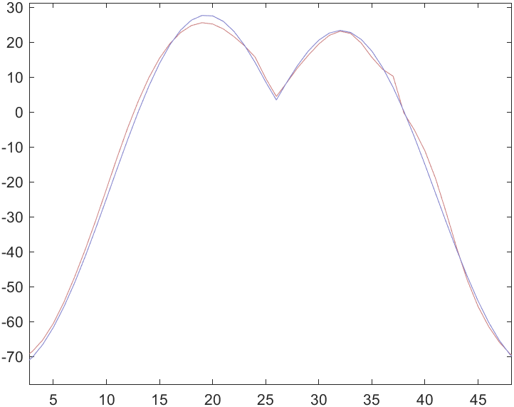
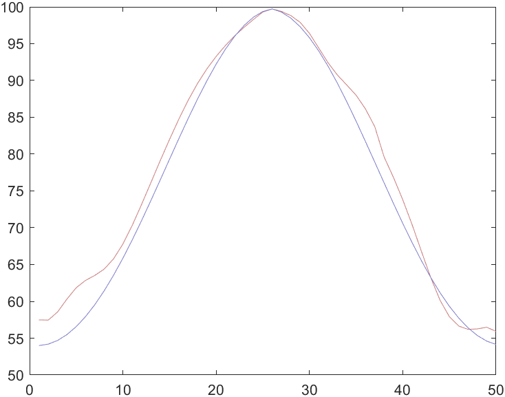
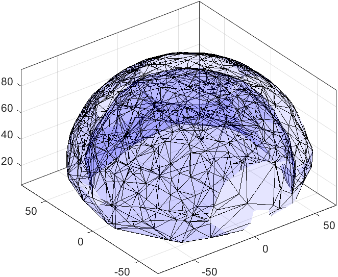
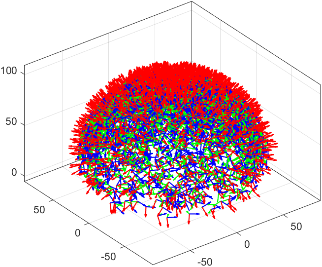

# 📚 Reference 
********************
Author： Jiewen Lai
********************            
This repo contains the matlab live script files (`.mlx`) that have been introduced in the following conference paper - 
```
@inproceedings{lai2019learning,
  title={A learning-based inverse kinematics solver for a multi-segment continuum robot in robot-independent mapping},
  author={Lai, Jiewen and Huang, Kaicheng and Chu, Henry K},
  booktitle={Proc. IEEE Int. Conf. Robot. Biomim.},
  pages={576--582},
  year={2019},
}
```
The interactive live script helps one to understand better how the code works. It is only for verficaition/proof-of-concept. 

I am using matlab r2020a.


## ✔️ What's it about?

- This repo presents a simplified model to represent a multi-segment continuum robot using virtual rigid links. Based on the model, its IK can be solved using a multilayer perceptron (MLP), a class of feedforward neural network (FNN). 
- The transformation between virtual joint space to task space is described using Denavit-Hartenberg (D-H) convention. 
- Using 20,000 established training data for supervised learning, the MLP reaches a mean squared error of 0.022 for a dual-segment continuum robot. 
- The trained MLP is then used to find the joints for different end-effector positions, and the results show a mean relative error of 2.90% can be on the robot configuration. 
- This simplified model and its MLP provide a simple method to evaluate the IK solution of a two-segment continuum robot, which can be further generalized and implemented in multi-segment cases. 

## 👨‍💻 Try it yourself!

`trainNetwork_DH.mlx`: 
- Compute the transformation matrix of a two-segment continuum robot based on the DH prameters (a virtual pseudo-rigid link model)
- Clear
- Based on the DH model, compute ans save the IO relationship between the configuration ($R^4$) and tip cartesian ($R^6$).
- Train MLP

```
Calculation mode: MEX
 
Training Feed-Forward Neural Network with TRAINLM.
Epoch 0/5000, Time 0.508, Performance 15.7992/0, Gradient 57.1367/1e-07, Mu 0.001/10000000000, Validation Checks 0/10
```
```
Epoch 1/5000, Time 13.5, Performance 7.9875/0, Gradient 55.9948/1e-07, Mu 0.0001/10000000000, Validation Checks 0/10
Epoch 2/5000, Time 27.533, Performance 2.7576/0, Gradient 17.9319/1e-07, Mu 0.0001/10000000000, Validation Checks 0/10
Epoch 3/5000, Time 40.413, Performance 1.8418/0, Gradient 6.068/1e-07, Mu 0.0001/10000000000, Validation Checks 0/10
Epoch 4/5000, Time 51.652, Performance 1.2755/0, Gradient 3.5822/1e-07, Mu 0.0001/10000000000, Validation Checks 0/10
...
...
Epoch 71/5000, Time 830.364, Performance 0.013127/0, Gradient 0.18144/1e-07, Mu 1e-05/10000000000, Validation Checks 10/10
Training with TRAINLM completed: Validation stop.
```
- Save the network locally as `ik_net.mat`
- Test an show error

`testPerformance.mlx`:
- load `ik_net.mat`
- Use forward kinematics to compute a desired path
- Put the desired path as an input to the trained network -> get inverse output
- Use the inverse as new input, and test it forwardly
- Evaluate the error - you will see something like this (for example)

<p align="left">
  
</p>

<p align="left">
  
</p>


`trainNetwork_DH_with_orientation.mlx` - similar to the `trainNetwork_DH.mlx` but with orientaiton.

<p align="left">
   &nbsp; 
</p>


`test_circle_hear.mlx` - test file for `trainNetwork_DH_with_orientation.mlx`.

`DH_para.mlx` - symbolic calculation.


